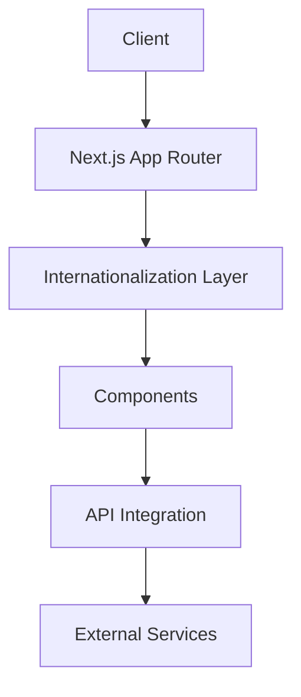
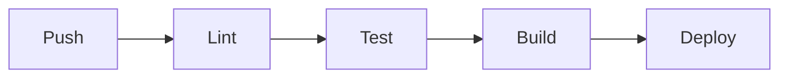

# Easy Diet Dashboard


A comprehensive easydieting platform built with Next.js, featuring multi-language support, user management, and meal planning capabilities.

<details>
<summary>📑 Table of Contents</summary>

- [Features](#features)
- [Quick Start](#quick-start)
- [Environment Setup](#environment-setup)
- [Architecture](#architecture)
- [Deployment](#deployment)
- [Security](#security)
- [Contributing](#contributing)
</details>

## ✨ Features

- 🌐 Multi-language support (Arabic/English)
- 📊 Interactive dashboards
- 🔐 Role-based access control
- 📱 Responsive design with PrimeFlex
- 📈 Chart.js integration
- 📄 PDF export capabilities
- 📊 Excel import/export

## 🚀 Quick Start

```bash
# Install dependencies
npm install

# Run development server
npm run dev

# Build for production
npm run build

# Start production server
npm start
```

## 🔧 Environment Setup

### Required Environment Variables

```env
API_URL=https://easydiet.kportals.net/api/v1
WEBSITE_URL=https://easydiet.kportals.net
```

### Image Configuration

```javascript
domains: [
    'kportals.net',
    'easydiet.kportals.net',
    'api.easydietkw.com',
    'localhost'
]
```

<details>
<summary>📦 Dependencies</summary>

### Core Dependencies
| Package | Version | Purpose |
|---------|---------|---------|
| next | 14.2.20 | React framework |
| react | 18.2.0 | UI library |
| next-intl | 3.26.1 | Internationalization |
| primereact | 9.6.2 | UI components |
| primeflex | 3.3.1 | Utility CSS |
| chart.js | 4.2.1 | Data visualization |

### Development Dependencies
| Package | Version | Purpose |
|---------|---------|---------|
| typescript | 5.1.3 | Type checking |
| eslint | 8.43.0 | Code linting |
| prettier | 2.8.8 | Code formatting |
| sass | 1.63.4 | CSS preprocessing |
</details>

## 🏗 Architecture



### Component Structure
- `app/` - Next.js app router pages
- `components/` - Reusable UI components
- `hooks/` - Custom React hooks
- `i18n/` - Internationalization config
- `utils/` - Utility functions

## 📤 Deployment

### Production Deployment

1. Set environment variables
2. Build the application
3. Deploy to your hosting platform

```bash
# Build
npm run build

# Start
npm start
```

### Staging Deployment

Use environment variables to configure staging environment:

```env
API_URL=https://example.com/api/v1
WEBSITE_URL=https://example.com
```

## 🔒 Security

### Recommended Security Measures

- [ ] Implement Dependabot for dependency scanning
- [ ] Set up GitHub Security alerts
- [ ] Configure rate limiting
- [ ] Enable CORS policies
- [ ] Implement API authentication

### Proposed CI/CD Pipeline



## 🤝 Contributing

1. Fork the repository
2. Create a feature branch
3. Commit changes
4. Push to the branch
5. Open a Pull Request

### Code Style

- Follow ESLint configuration
- Use Prettier for code formatting
- Follow TypeScript strict mode guidelines

```bash
# Format code
npm run format

# Lint code
npm run lint
```

## 📝 License

MIT License - see the [LICENSE.md](LICENSE.md) file for details

---

<details>
<summary>🔄 Version Compatibility Matrix</summary>

### Core Dependencies
| Package | Minimum Version | Maximum Version | Current |
|---------|----------------|-----------------|---------|
| Node.js | 16.x | 20.x | - |
| Next.js | 14.0.0 | 14.2.x | 14.2.20 |
| React | 18.0.0 | 18.2.x | 18.2.0 |
| TypeScript | 5.0.0 | 5.1.x | 5.1.3 |
</details>

> 📌 **Note**: This README is automatically generated and maintained. Updates are triggered by source file changes.
